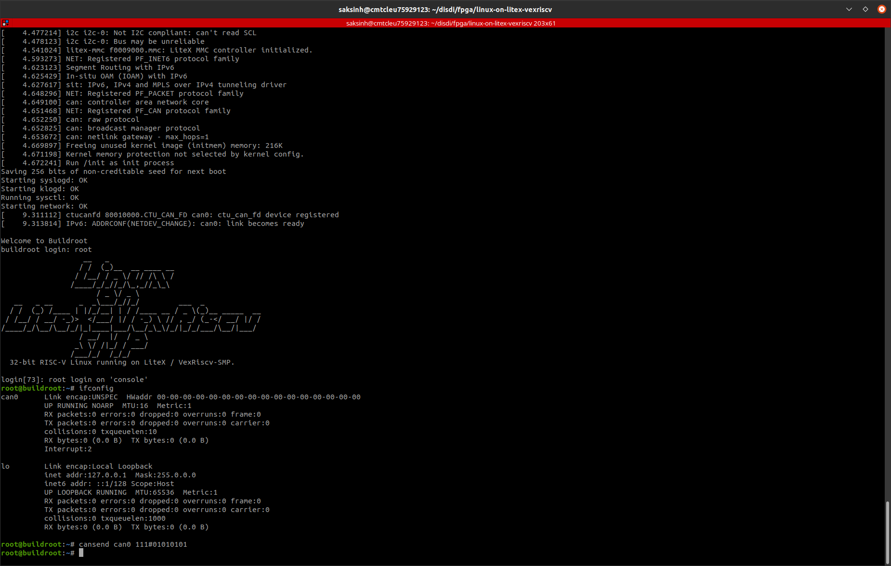

# Communication with CAN devices

**Steps to bringup CAN communication on a 32-bit RISC-V CPU on Xilinx FPGA board Arty A7-100T.**

* We would need to install a handful of very useful CANbus utilities for linux.
This is packaged as can-utils for Linux.

Enable `BR2_PACKAGE_CAN_UTILS=y` in buildroot rootfs.

* We would also need iproute2 package to bringup CAN on Linux where it is treated as a network device.

Enable BR2_PACKAGE_IPROUTE2=y in buildroot rootfs.

* Once resulting rootfs is flashed to target, socketcan device can be brought up on Linux with 100 Kbit/s bitrate.

```
ip link set can0 type can bitrate 100000
ip link set up can0
```

* Connect CAN Controller  to CAN Transceiver PMOD

CAN Controller output pins are exposed on PMOD-C(JC) of Arty A7-100T board. 
Connect [CAN Transciever PMOD](https://github.com/disdi/canpmod) to board over PMOD-C(JC).

* Connect a CAN device to other end of CAN Transciever PMOD.

* Communicate between Arty A7-100T and CAN device usinf cansend from can-utils package.

