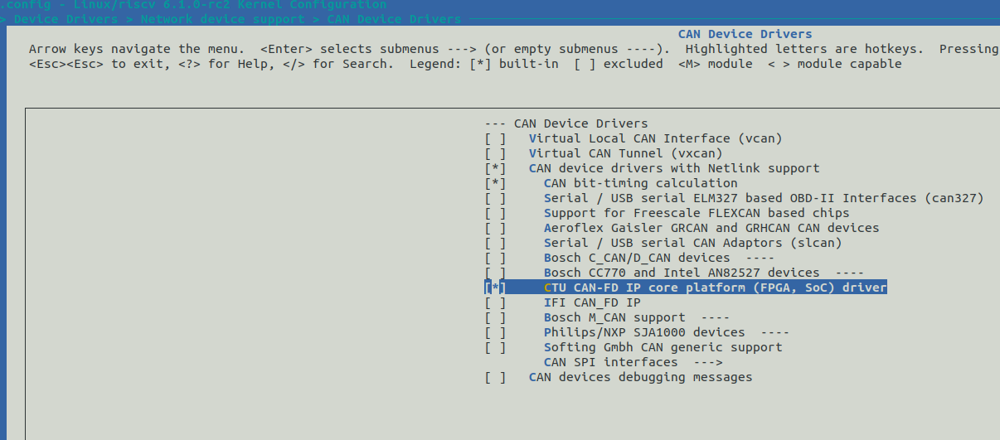
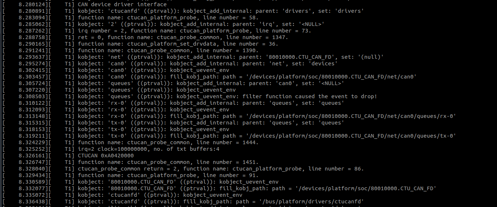
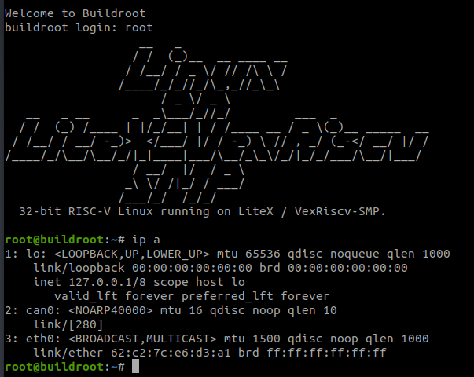

# Linux Bringup

**Steps to bringup Linux on LiteX with a 32-bit RISC-V CPU on Xilinx FPGA board Arty A7-100T and run 32-bit Linux.**

* Clone the [linux-on-litex-vexriscv](https://github.com/disdi/linux-on-litex-vexriscv) reopsitory with CAN support.
```
git clone https://github.com/disdi/linux-on-litex-vexriscv
```

* Create bitstream with Linux support for Arty A7-100T and flash it.
```
./make.py --board=arty --variant=a7-100  --build --load
```

* Create kernel binaries with CAN support enabled

```
git clone http://github.com/buildroot/buildroot
cd buildroot
make BR2_EXTERNAL=../linux-on-litex-vexriscv/buildroot/ litex_vexriscv_defconfig
```

Enable CTUCAN in linux kernel with `make menuconfig`



Build the kernel binaries
```
make
```
The binaries are located in `images`.

* Create [new devicetree](https://github.com/disdi/linux-on-litex-vexriscv/blob/master/patch/arty.dts) since somehow devicetree created by Litex in not currently configurable.

Compile new devicetree binary with dtc compiler and replace it with one created by Litex. 
```
cd patch
dtc -O dtb -o arty.dtb arty.dts
cp arty.dtb images/rv32.dtb

```

* Load the kernel binaries using TFTP server

Connect the board's Ethernet port to a switch/router port that places it into the same LAN as the machine acting as your TFTP server. 

Ensure that kernel binaries are available in the TFTP directory, and that the TFTP server (or socket, if using systemd) is started:
```
sudo cp images/* /var/lib/tftpboot/
sudo systemctl start tftp.socket
```

* Open ttyUSB port to read board serial logs.

To connect to the system's console, use the screen utility (assuming /dev/ttyUSB1 is used, below):
```
screen /dev/ttyUSB1 115200
```

* Linux should bootup and bootup logs should show CAN peripheral.



* Linux socketcan interface should be up.

[Socketcan](https://www.kernel.org/doc/html/next/networking/can.html) interface should bringup CAN as a networking device.



