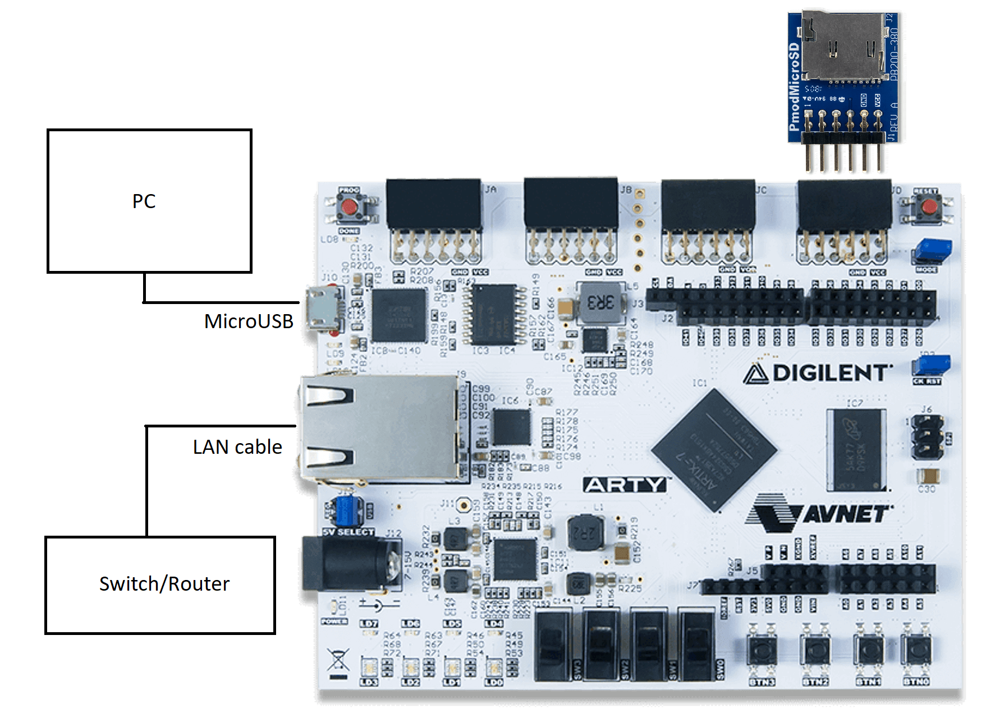
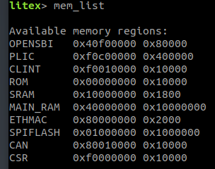

# Litex Bringup

**Steps to bringup CAN bus on a 32-bit RISC-V CPU on Xilinx FPGA board Arty A7-100T!**

* Install prerequisite packages
```
sudo apt update
sudo apt upgrade
sudo apt install openocd fakeroot verilator python3 meson gtkterm gawk texinfo git python3-pip bison device-tree-compiler autoconf automake autotools-dev curl python3 libmpc-dev libmpfr-dev libgmp-dev build-essential flex gperf libtool patchutils bc zlib1g-dev libexpat-dev ninja-build
```

* Checkout  [Litex Repo](https://github.com/disdi/litex).

```
git clone https://github.com/disdi/litex
cd litex

```

* Install cross-compiler toolchain for RISC-V.

```
python3 ./litex_setup.py --gcc=riscv
```

Install [openxc7](https://github.com/openXC7) or [Xilinx Vivado](https://www.xilinx.com/products/design-tools/vivado.html).


* Install Litex pacakges

```
python3 ./litex_setup.py --dev --init
```

* Install litex with CAN support
```
python3 ./litex_setup.py --init --install --user 
```

* Current CAN Litex support is implemented on [Xilinx FPGA board Arty A7-100T](https://digilent.com/shop/arty-a7-100t-artix-7-fpga-development-board/).

Checkout  [Litex Board Repo](https://github.com/disdi/litex-boards).

```
git clone https://github.com/disdi/litex-boards
cd litex-boards
```
 
* Build bitstream for Arty board. (Install riscv toolchain and Vivado if not already present.)
```
python3 litex_boards/targets/digilent_arty.py --variant=a7-100 --build

```

It creates a bitstream file at *build/digilent_arty/gateware/digilent_arty.bit*

* Connect Arty A7-100T (J10) to PC using a MicroUSB cable (power, console and programming).
 
Optionally connect Arty A7-100T (J9) to Switch/Router using a LAN cable and PMOD Sdcard (J10).

 
 
Load the bitstream from PC to Arty with --load option or directly using openocd. 

```
python3 litex_boards/targets/digilent_arty.py --variant=a7-100 --load

```

* Open ttyUSB port to read board serial logs.

To connect to the system's console, use the screen utility (assuming /dev/ttyUSB1 is used, below):
```
screen /dev/ttyUSB1 115200
```

Litex should bootup and *mem_list* should show CAN peripheral.



This should match the value of CSR register address generated by Litex.

```
grep "#define CSR[A-Z_]*BASE"  build/digilent_arty/software/include/generated/csr.h
```