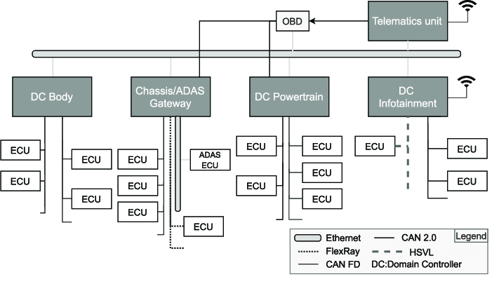
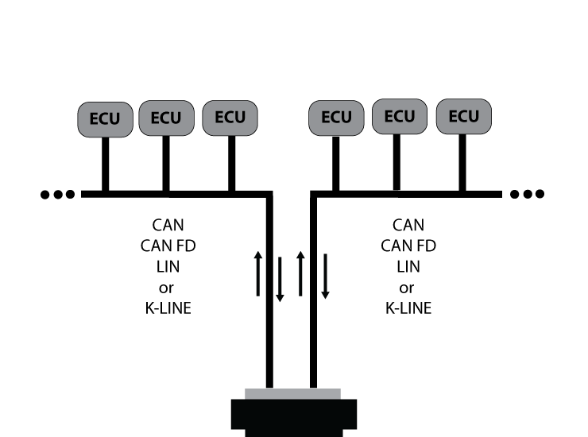
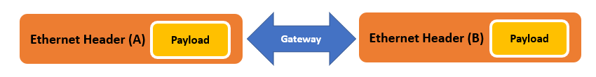

# LibreCar Control Wiki

**Welcome to the LibreCar Control Wiki!**

Current trend in  automotive world is moving towards a zone architecture that classifies ECUs by their physical location inside the vehicle, leveraging a central gateway to manage communication. This physical proximity reduces cabling between ECUs to save space and reduce vehicle weight, while also improving processor speeds.

ECUs with actuators and sensors are connected by lower bandwidth bus of 1Mb/s with CAN and main connection backbone is higher bandwidth of 10Mb/s or 100Mb/s with Automotive Ethernet.  

 

LibreCar Control is a automotive exploration tool that can emulate connections inside an automotive vehicle talking between different protocols and buses. 

It can be used to:

- [x] Send and Receive CANbus data from any low cost fpga inside a vehicle.
 

- [ ] Send and Receive Ethernet packets from any low cost fpga inside a vehicle.

- [ ] Act as a CAN-Ethernet Gateway allowing the connection of CAN bus over IP networks inside a vehicle.

 

We use [LiteX SoC builder framework](https://github.com/enjoy-digital/litex) to provide a RISC-V soft processor core and integrate with it peripherals like CAN and Ethernet used in automotive world